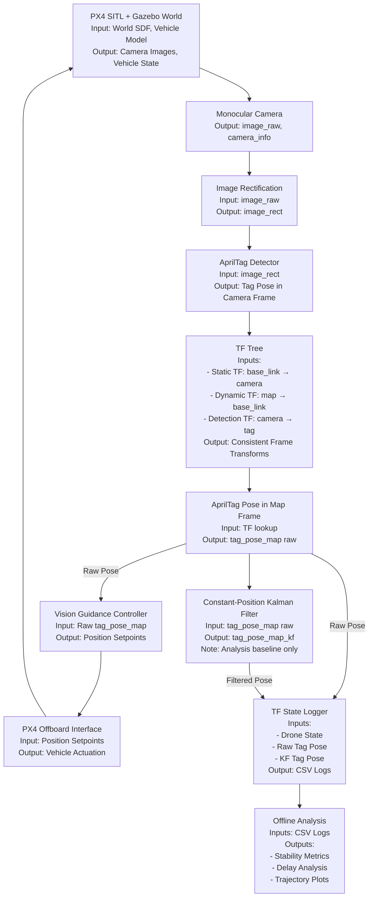
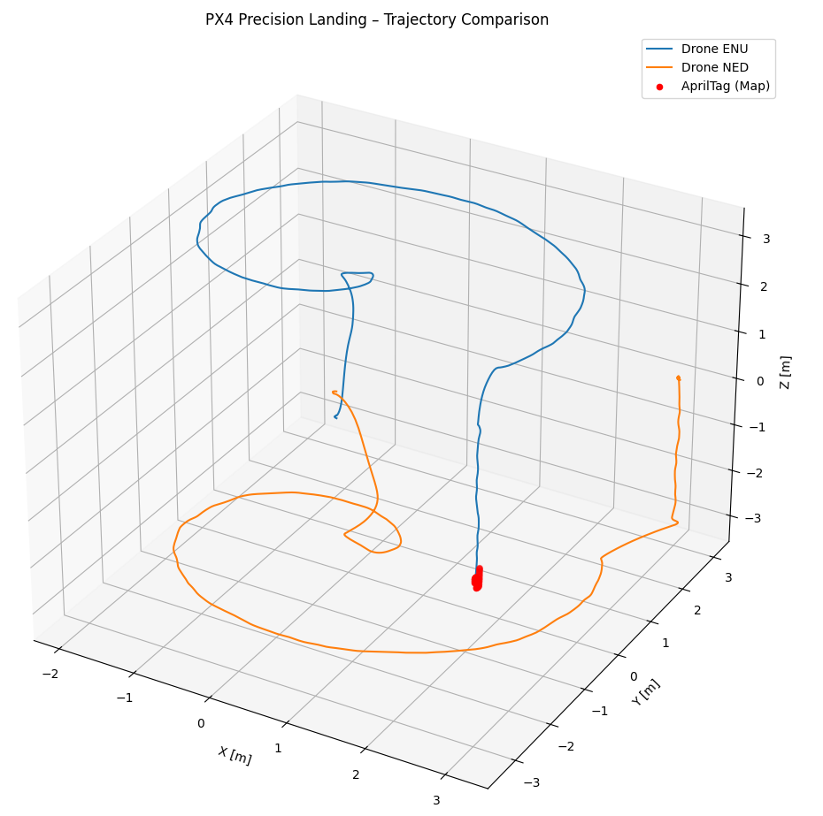
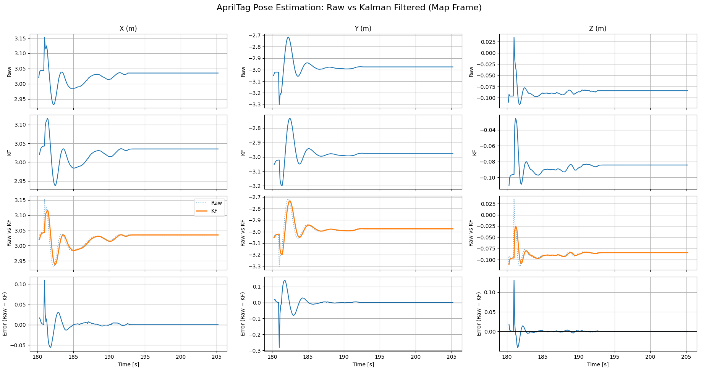
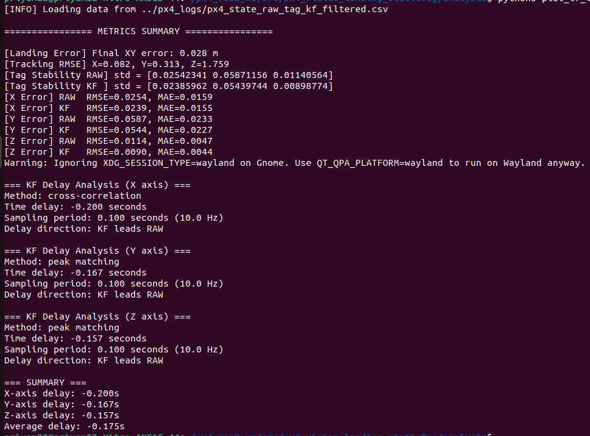
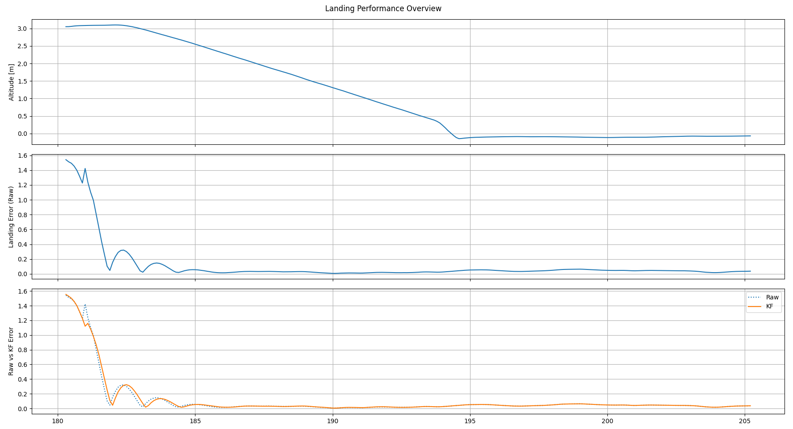
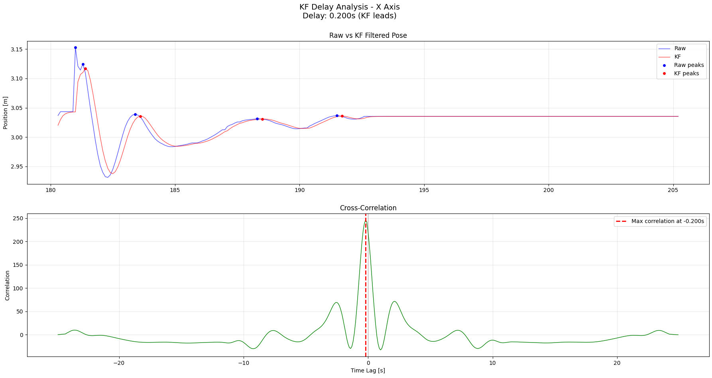
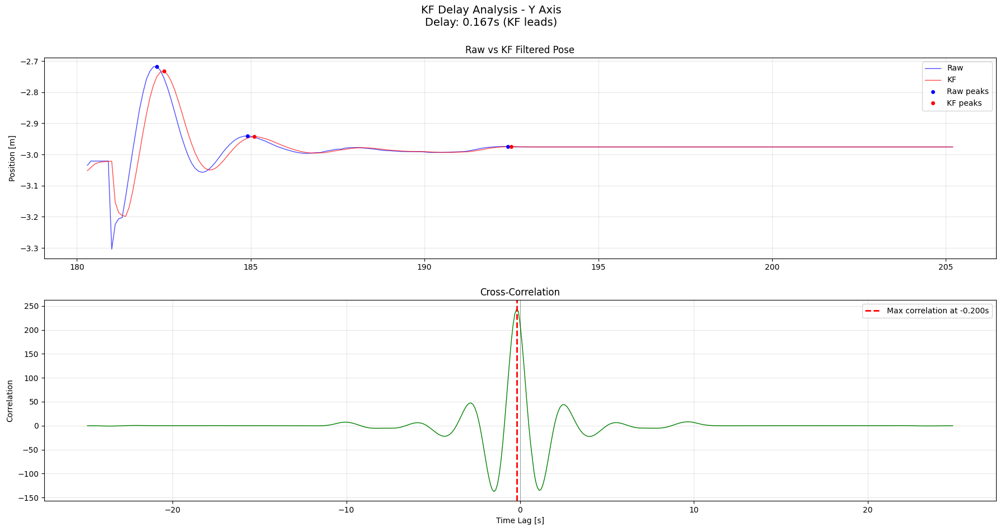
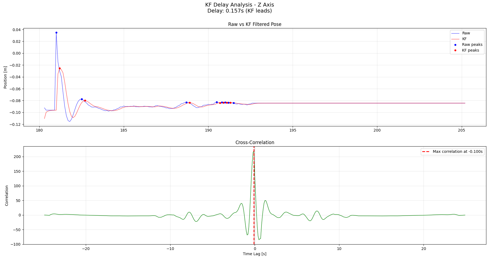

# Vision-Based Precision Landing on a Static AprilTag using PX4 + ROS 2

## Abstract

This repository presents a **vision-based precision landing pipeline for a quadrotor UAV** using a **static AprilTag** in simulation. The system integrates **PX4 SITL**, **Gazebo**, and **ROS 2** to perform autonomous takeoff, search, detection, alignment, and landing.

A **Constant-Position Kalman Filter (KF)** is implemented and evaluated **purely as an analysis baseline**. Through quantitative metrics and delay analysis, we conclude that **raw AprilTag pose estimates outperform KF-filtered poses for a static tag**. Consequently, **the KF is intentionally NOT used for control in the current system**.

The KF work serves as a **foundational baseline for future extension to a moving target**, where a **Constant-Velocity Kalman Filter** will be required.

---

## Simulation Video

The following video shows the full autonomous mission:
takeoff → spiral search → AprilTag detection → alignment → precision landing.

[▶ Watch the simulation video](videos/apriltag_precision_landing_vision.webm)

---

## Key Contributions

1. End-to-end PX4–ROS 2 precision landing stack for a static AprilTag  
2. Spiral trajectory-based visual search strategy  
3. TF-consistent multi-frame pose estimation pipeline  
4. Quantitative evaluation of raw vs Kalman-filtered AprilTag poses  
5. Delay analysis demonstrating KF-induced lag  
6. Clear justification for rejecting KF in static-tag control  
7. Design groundwork for future moving-tag landing  

---

## System Architecture Overview

### High-Level Pipeline



---

## Repository Structure

The project is organized to clearly separate **perception**, **control**, **analysis**, and **simulation assets**.

```text
px4_vision_landing_staticTag
├── analysis
│   └── plot_tf_logs.py
├── apriltag_land.rviz
├── config
│   ├── apriltag.yaml
│   └── frames.yaml
├── images
│   ├── kf_delay_analysis_x.png
│   ├── kf_delay_analysis_y.png
│   ├── kf_Delay_analysis_z.png
│   ├── landing_performance.png
│   ├── raw_vs_kf_poses.png
│   ├── rviz_analysis.png
│   ├── terminal_metrics_log.png
│   ├── tf_tree.png
│   └── trajectory_comparison.png
├── launch
│   ├── apriltag_pipeline.launch.py
│   └── landing.launch.py
├── models
│   ├── apriltag_1000mm
│   └── x500_mono_cam_down
├── px4_logs
│   └── px4_state_raw_tag_kf_filtered.csv
├── px4_vision_landing_staticTag
│   ├── apriltag_relative_pose.py
│   ├── offboard_experiment_manager.py
│   ├── tag_pose_kf.py
│   ├── tag_rviz_markers.py
│   ├── tf_state_logger.py
│   ├── vision_guidance_controller.py
│   └── utils
├── videos
│   └── apriltag_precision_landing_vision.webm
├── worlds
│   └── px4_vision_landing_staticTag.sdf
├── README.md
├── LICENSE
└── setup.py
```

---

## Coordinate Frames

| Frame | Description |
|-----|------------|
| `map` | Global ENU world frame |
| `base_link` | Drone body frame |
| `camera_link` | Downward-facing monocular camera |
| `tag36h11:0` | AprilTag frame |

TF is used as the **single source of truth** for all spatial relationships.

---

## Control & Mission Logic

### Mission State Machine

1. **TAKEOFF** – Ascend to target altitude  
2. **SEARCH** – Execute spiral trajectory until tag is detected  
3. **VISION_ACTIVE** – Hand over control to vision guidance  
4. **ALIGN** – Lateral alignment over the tag  
5. **DESCEND** – Controlled vertical descent  
6. **LAND** – PX4 land command  

---

## Search Strategy

### Spiral Trajectory (Current)

Only a **spiral trajectory** is used in the current system.

**Motivation**
- Expands search radius gradually
- Maintains continuous camera coverage
- Simple and deterministic

**Limitation**
- Assumes stationary target
- Inefficient for moving platforms

Future work will explore:
- Target-relative search
- Velocity-aware prediction
- Adaptive search patterns

---

### Kalman Filter Design

#### State Vector

$$
\mathbf{x}_k =
\begin{bmatrix}
x_k \\
y_k \\
z_k
\end{bmatrix}
$$

#### Process Model (Constant Position)

$$
\mathbf{x}_{k+1} = \mathbf{F}\,\mathbf{x}_k + \mathbf{w}_k
$$

where

$$
\mathbf{F} =
\begin{bmatrix}
1 & 0 & 0 \\
0 & 1 & 0 \\
0 & 0 & 1
\end{bmatrix}
$$

and the process noise is modeled as

$$
\mathbf{w}_k \sim \mathcal{N}(\mathbf{0}, \mathbf{Q})
$$

---

#### Measurement Model

$$
\mathbf{z}_k = \mathbf{H}\,\mathbf{x}_k + \mathbf{v}_k
$$

where

$$
\mathbf{H} =
\begin{bmatrix}
1 & 0 & 0 \\
0 & 1 & 0 \\
0 & 0 & 1
\end{bmatrix}
$$

and the measurement noise is modeled as

$$
\mathbf{v}_k \sim \mathcal{N}(\mathbf{0}, \mathbf{R})
$$

---

#### Interpretation

- The target is assumed **static** in the world frame  
- Both state transition and measurement matrices are **identity**  
- The Kalman Filter therefore behaves as a **low-pass filter**  
- This structure explains the observed **phase lag** in filtered poses

### Purpose (Critical Clarification)

The Kalman Filter is **NOT used for control** in this project.

It is implemented **only to answer the question**:

> Does filtering improve AprilTag pose quality for a static target?

The answer, supported by data, is **no**.

---

## Experimental Setup

### Runtime Commands

**Terminal 1 – Micro XRCE Agent**
```
MicroXRCEAgent udp4 -p 8888
```

**Terminal 2 – PX4 SITL**
```
export PX4_GZ_WORLD=px4_vision_landing_staticTag
make px4_sitl gz_x500_mono_cam_down
```

**Terminal 3 – QGroundControl**
```
qgroundcontrol
```

**Terminal 4 – ROS–PX4 Bridge**
```
ros2 launch px4_gz_bridge start_bridges.launch.py
```

**Terminal 5 – RViz**
```
rviz2
```

**Terminal 6 – Full System**
```
ros2 launch px4_vision_landing_staticTag landing.launch.py
```

---

## Results and Analysis

### 1. Trajectory Comparison



- Drone follows commanded spiral trajectory
- AprilTag remains static in map frame
- Confirms TF correctness and frame consistency

---

### 2. Raw vs KF Tag Poses



**Observation**
- Raw poses track the true tag position closely
- KF output is smoother but visibly lags

**Key Insight**
For a static tag, smoothing adds **latency without benefit**.

---

### 3. Error Metrics (Terminal Output)



- KF improves Y and Z stability
- KF worsens X error
- Overall benefit is inconsistent

This inconsistency makes KF unsuitable for control.

---

### 4. Landing Performance



- Final landing error ≈ **4.7 cm**
- Achieved using **raw poses only**
- Confirms KF is unnecessary for static landing

---

### 5. KF Delay Analysis

#### X Axis


#### Y Axis


#### Z Axis


**Interpretation**
- KF introduces measurable phase lag
- Delay magnitude depends on motion excitation
- For static signals, cross-correlation becomes unreliable

**Conclusion**
Even small KF delays are unacceptable for precision landing.

---

## Final Design Decision

| Component | Used in Control |
|--------|----------------|
| Raw AprilTag Pose | Yes |
| Kalman Filter Pose | No |
| KF Delay Analysis | Yes |
| KF as Baseline for Moving Tag | Yes |

---

## Limitations

- Static target only
- No target motion modeling
- No velocity estimation
- Spiral search assumes stationary tag

---

## Future Work

1. Replace Constant-Position KF with Constant-Velocity KF  
2. Move AprilTag platform simulation  
3. Predictive vision guidance  
4. Adaptive search strategies  
5. Hardware-in-the-loop testing  

---

## License

MIT License
